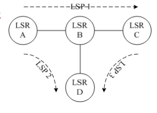
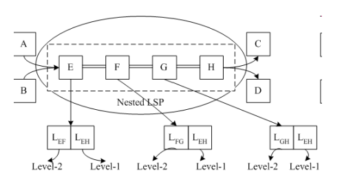
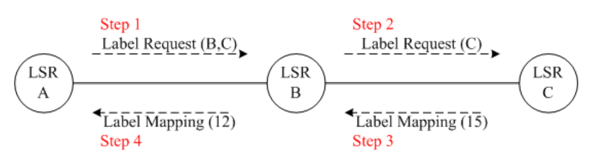

MultiProtocol Label Switching
===
🔙 [MENU README](../README.md)

# History of Label Switching
1. **IP forwarding** in the Internet is based on the **datagram model**
2. **ATM(Asynchronous Transfer Mode)** is widely deployed in **Internet backbone** and **is connection-oriented (virtual circuit)**
3. MPLS represents the convergence of two fundamentally different approaches in data networking: **datagram and virtual circuit**
4. Several approaches have been standardized for running IP over ATM networks, while these are cumbersome
5. The need for more seamless IP/ATM integration led to the deployment of label switching
6. **Label switching uses a short, fixed-length label inserted in the packet header to forward packets**
7. A **label-switched router (LSR)** uses the label as an index to find the next hop and the corresponding new label
8. The path that the packet traverses through a network is defined by the transition in label values, and this path is called a **label-switched path (LSP)**
9. **IETF MPLS working group was formed to standardize the encapsulation formats and the label distribution protocols**

---
# MPLS Motivations
1. Though IP/ATM integration was the main driver in the development of label switching, IETF working group recognized that label switching could potentially be the solution of:
   - Simplify the packet forwarding process
   - Ability to **support explicit path in label switching**
---
# Simpler Forwarding Paradigm
1. **Traditional IP packet forwarding: classification and route lookup,based on IP address of destination.**
2. **Label switching: simple exact match for a small label, thus improve the scalability**
3. Protocol-independent forwarding
   - Routing and forwarding are tightly coupled in current IP architecture
   - IPv4 → IPv6, we need to change forwarding scheme
4. Forwarding granularity
   - Current IP routing is destination based: all packets with the same network number are grouped and treated the same way
   - Label switching allows multiple granularities to be supported in addition to the current destination-based one by setting different LSP with different forwarding treatment
---

# Label Switching Concepts
1. The construction of a forwarding table by the control component could be modeled as constructing a set of FECs and the next hop for each of these FECs 
2. **Forwarding Equivalence Class (FEC) == BA**
   - **Partitioning packets into a set of classes** (One Path)
   - Each class is called a FEC
   - Same treatment for packets within the same FEC
   - Ex., destination-based IP routing

---

# MPLS
1. Label
   - **A short, fixed length, logically significant** identifier used to identify a FEC and forward packets
   - **No internal structure**
2. Binding between label and FEC
   - One-to-one mapping
   - Upstream LSR (label switching router), e.g., router A
   - Downstream LSR: e.g., router B
   - **Outgoing label: e.g., F**
   - **Incoming label: e.g., L**
   - **Labels are downstream assigned and binding is distributed from downstream to upstream**

   
3. **Label distribution protocol (LDP)** [LSP setup]
   - **A set of procedures by which two LSRs learn each other’s MPLS capabilities and exchange label-mapping info**
4. **Label switching table (a.k.a incoming label map, ILM)**
   - Maintaining the mappings between an incoming label to the outgoing interface and the outgoing label **(Routing Table)**
   - **The entry that the incoming label points to is called the next-hop label-forwarding entry (NHLFE)** **(Every Record in Router)**
5. **FEC-to-NHLFE map** (FTN)
   - Mapping each FEC to a set of NHLFEs
   - **The first Packet go into MPLS**
   - **Used when forwarding unlabeled packets**
   - These unlabeled packets must be **labeled before being forwarded**
6. **Label swapping**
   - LSR examines packet’s label
   - Using the label as an index to obtain a NHLFE
   - **Using info in this NHLFE, replace packet’s label and determine next-hop**
7. **Label assignment and distribution**
   - Two different modes of downstream label distribution
     - **Downstream-on-demand mode**
        An LSR **explicitly requests** a neighbor for a label binding for a particular FEC
     - **Unsolicited downstream mode**
        Allowing an LSR to distribute label bindings to its neighbors **that have not explicitly requested them**
8. **Label merging (same FEC)**
   - **Two or more LSPs are merged into one**
   - E.g., it’s possible for LSR B to use the same label between LSR B and LSR D for all packets from LSP 2 and LSP 3
   - When an LSR has bound multiple incoming labels to a particular FEC, this LSR may have a single outgoing label to all packets
   - Note that once the packets are forwarded with the same outgoing label, the info that they arrived from different interfaces and/or with different incoming labels is lost
   - Label merging reduces the requirements on label space

    

9. **Hierarchical Label Stack**
   - Multiple labels to be encoded into a packet form a label stack
   - Used to construct nested LSPs, similar to IP-in-IP tunneling
   - Operations: last-in, first-out

10. **Penultimate hop popping**
    - Allow the egress to do a single lookup
    - The egress forwards packets according to the network layer destination addresses
    - **When penultimate hop popping is done, the LSP egress need not even be an LSR**
11. Two types of peering for exchanging stack Labels
    - **Explicit**: LDP connections are set up between **remote** LDP peers
    - **Implicit** **(9 e.g Hierarchical Label Stack)**
      - Stack labels are piggybacked onto the LDP messages when the lower-level LSP is set up between the implicit-peering LSRs
      - The intermediate LDP peers of the lower-level LSP propagate the stack label as an attributes of the lower-level labels

12. Route selection and explicit routing
    - **Hop-by-hop routing**
      - Relying on IP routing information to set up LSPs
      - The control module at each hop **calls the routing module to get the next hop**
    - **Explicit routing**
      - One of the most important features in MPLS
      - The ingress or egress of a **LSP specifies the entire route**
      - Usually the route is determined to **achieve certain pre-specified objectives** (constraint-based routing) 
      - Two types of explicit routing
        - **Strictly explicit routing**: **the entire route for the LSP** is specified
        - **Loosely explicitly routing**: **only part of the route** for an LSP is specified
13. Lack of outgoing label
    - Conventional forwarding
    - **Discard the packet (preferred)**
14. How about lack of incoming label?
    - Just a IP Packet
    - **Discard the packet (preferred)**
15. Carrying label
    - **Link-layer header**(Layer 2)
      - Ex, **ATM**, Frame Relay
    - **Shim label header**(Layer 2.5)
      - **Between the link layer and the network layer**
      - E.g., Ethernet, token ring, PPP, etc

16. Loop detection
    - **Time to live (TTL) functions a way to suppress loops**
    - Two ways to handle TTL
      - **“shim” label header**
        - TTL value = TTL value in network-layer header
        - Decremented at each LSR-hop
        - Copied into the network-layer header TTL field when the packet emerges from its LSP
      - **Link-layer header**
        - Non-TTL LSP segment (L2 switch && without a TTL field)
        - The ingress decrements the TTL values before forwarding packets into a non-TTL LSP segment

17. Loop detection for the scenario of MPLS packets forwarded on ATM labels (no TTL field in ATM header)
    - The use of **path vector**
      - Path vector is a field within a label distribution message
      - Path vector contains a list of the LSRs the message has traversed
      - When an LSR propagates a message containing a path vector, it adds its LSR ID to the list
      - An LSR detects a loop by receiving a message with a path vector containing its LSR ID
    - Hop count
      - A hop count is used to record the number of LSRs the message has traversed
      - When propagating a message, an LSR increments the count
      - While this count reaching a configured maximum, it considers the LSP to have a loop
---

# Label Distribution Protocols (Label Switching)
1. **Label distribution protocol (LDP)**
   - Proposed by IETF MPLS working group, and was the only considered protocol initially
   - Designed to support hop-by-hop routing
2. **Constraint-based LSP setup using LDP**
   - Designed to support explicit routing
   - Add a set of extensions to LDP to support explicit routing
   - Referred to as CR-LDP (constraint routing label distribution protocol)
3. **Extensions to RSVP for LSP tunnels**
   - Designed to support explicit routing
   - Extend RSVP protocols to perform label distribution
   - Referred to as RSVP-TE (RSVP with traffic-engineering extension)
---

# LDP
1. Since LDP supports hop-by-hop routing, the two LSRs that use LDP to exchange label/FEC mapping information are known as LDP peers
2. LDP peers exchange 4 categories of messages
   - **Discovery messages**: announcing and maintaining the presence of an LSR in a network by periodically sending Hello messages
   - **Session messages**: establishing, maintaining, or terminating sessions between LDP peers
   - **Advertisement messages: creating, changing, or deleting label mappings for FECs**
   - **Notification messages: distributing advisory information and error information**
3. LDP session management
   - Two LSRs establish communication channel and label space through **Hello exchanges**
   - Initialization process is then followed (protocol version, label distribution method, timer value, etc)
   - An LSR only accepts initialization messages from LSRs that it has exchanged Hello messages with
   - Peer and session relationship is maintained by sending Hello and **Keepalive messages periodically**
   - An LSR considers the peer or the session down if the corresponding timer expires before new messages are received
3. Label distribution and management
   - LDP supports both **downstream on demand** and **downstream unsolicited label distribution**
   - Both methods can be used in the same network, while for any given LDP session, only one should be used
   - LSP set up independent between LSRs along the path
     - Each LSR may advertise label mappings to its neighbors at any time it desires
     - It could happen that an upstream label can be advertised before a downstream label is received
   - LSP set up in order **from egress to ingress**
     - An LSR may send a label mapping only for a FEC for which it has a label mapping for the FEC next hop or for which the LSR is the egress
     - Otherwise, the LSR must wait until a label from a downstream LSR is received before further passing corresponding labels to upstream LSRs
---

# CR-LDP
1. Largely **based on the LDP** specification with a set of extensions for carrying explicit routes and resource reservations
2. **Support both strict and loose modes of explicit routes**
3. An explicit route is represented in a Label Request message as a list of nodes or groups of nodes along the explicit route
4. **Procedures of LSP setup**

5. Resource reservation and class
   - CR-LDP allows resources to be reserved for explicit routes
   - Types provides
     - Parameter-based specifications (e.g., peak rate and committed rate)
     - Negotiate-based (a LSR can specifies a smaller value for a parameter if it cannot be satisfied with existing resources)
     - Class-based (network resources are classified into resource classes)

6. **Path preemption and priorities**
   - Each LSP has two parameters: **setup priority** and **holding priority**
   - Setup priority reflects the preference for adding a new LSP
   - Holding priority reflects the preference for holding an existing LSP
   - A new LSP can preempt an existing LSP if the setup priority of the new LSP is higher than the holding priority of the existing LSP
   - Value range of priority: **0(highest) ~ 7(least)**

---

# RSVP-TE
1. RSVP-TE extends the original RSVP protocol to perform label distribution and support explicit routing
2. An LSP in RSVP-TE is referred to as an LSP tunnel
3. Procedures of explicit route setup
   - Explicit route added to PATH message
   - Label request is through PATH message and Label binding is through RESV message
4. Reservation styles
   - Only FF and SE reservation styles are supported
   - FF creates a distinct reservation for each LSP
   - SE is useful for backup LSPs which are used only if their corresponding active LSPs fail
5. Rerouting LSP tunnels
   - Objective: optimize the resource utilization in the network or restore connectivity after network failures
   - Utilized technique is “**make before break**”
     - A replacement LSP tunnel is first setup and then traffic switches over, and finally the old LSP tunnel tears down
     - During the transition period, the old and new LSP tunnels may coexist and so compete with each other for resource they have in common
     - Make before break may lead to a racing condition where the new LSP tunnel cannot be established because the old LSP tunnel has not released resources, yet the old tunnel cannot release the resources before the new tunnel is established
     - This problem is solved by using **SE reservation style**: the old and new LSP share resources along links they have in common