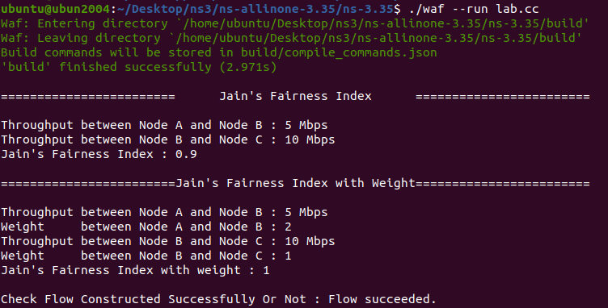

Lab1 - ns3
===
> Advisor : Hsi-Lu Chao
> TAs : Zheng-Feng Li
> Tien-Wen Chang
> Chun-Sheng Chen
> 2023.10.13

---


# Implementation of code
1. 建立三個Node，代表三個網路節點
    ```clike
    NodeContainer nodes;
    nodes.Create(3);
    ```
2. 模擬三個節點中的Network flow
    - 使用PointToPointHelper建立點對點之間的連接
    - 參數DataRate代表數據傳輸速率
    - 參數Delay代表傳播延遲
    - 創建和安裝網絡設備，建立網絡拓撲，將2個flow分別安裝在nodes中
    ```clike

    //flow 1 (node 0 -> node 1)
    //Traffic pattern : data Size is 5 Mbps、delay is 10 ms
    PointToPointHelper flow1;
    flow1.SetDeviceAttribute("DataRate", DataRateValue(DataRate("5Mbps")));
    flow1.SetChannelAttribute("Delay", TimeValue(MilliSeconds(10)));

    //flow 2 (node 1 -> node 2)
    //Traffic pattern : data Size is 10 Mbps、delay is 20 ms
    PointToPointHelper flow2;
    flow2.SetDeviceAttribute("DataRate", DataRateValue(DataRate("10Mbps")));
    flow2.SetChannelAttribute("Delay", TimeValue(MilliSeconds(20)));

    NetDeviceContainer devices = flow1.Install(nodes.Get(0) , nodes.Get(1) );
    devices.Add (flow2.Install(nodes.Get(1) , nodes.Get(2)));

    ```
3. 安裝與配置
    使用InternetStackHelper將網路協定安裝在NodeContainer上
    ```Clike
    // install stack
    InternetStackHelper stack;
    stack.Install (nodes);
    ```
    配置IPv4地址與遮罩，並分配給 NetDeviceContainer 網路設備
    ```Clike
    // allocate ip address
    Ipv4AddressHelper address;
    address.SetBase ("10.1.1.0", "255.255.255.0");
    Ipv4InterfaceContainer interfacesAB = address.Assign (devices);
    ```
    創建UDP Echo Server並監聽port:9，等待接收UDP封包
    ```Clike
    // construct UDP protocal
    UdpEchoServerHelper echoServer (9);
    ```
    啟動一個UDP echo Server在地三個節點上，用於接收封包模擬一個基本的回聲服務。
    於模擬開始後1秒啟動UDP Echo Server
    於模擬開始後10秒停止監聽和回聲
    ```Clike
    ApplicationContainer serverApps = echoServer.Install (nodes.Get (2)); // install server on node 2
    serverApps.Start (Seconds (1.0));
    serverApps.Stop (Seconds (10.0));
    ```
    在第一個節點啟動UDP Echo Client，嘗試將封包發送到目標位址的連接埠9
    MaxPackets：UDP 客戶端應用程序的最大packet數
    Interval：UDP Client 端應用程序發送packet的時間
    PacketSize：UDP packet的大小
    ```Clike
    UdpEchoClientHelper echoClient (interfacesAB.GetAddress (0), 9); // create application on node 0
    echoClient.SetAttribute ("MaxPackets", UintegerValue (1));
    echoClient.SetAttribute ("Interval", TimeValue (Seconds (1.0)));
    echoClient.SetAttribute ("PacketSize", UintegerValue (1024));
    ```
    安裝UDP Echo Client應用程式到節點0
    於模擬開始後2秒啟動UDP Echo Client
    於模擬開始後10秒停止，所以模擬中的8秒會送出1個Packet
    ```Clike
    ApplicationContainer clientApps = echoClient.Install (nodes.Get (0)); // install application on node 0
    clientApps.Start (Seconds (2.0));
    clientApps.Stop (Seconds (10.0));
    ```
4. Output Throughput
    取得 flow 0 ➝ 1 及 1 ➝ 2 的    DataRateValue 並將數據速率轉換為 Mbps
    ```Clike
    DataRateValue dataratevalueAB;
    devices.Get(1)->GetAttribute("DataRate",dataratevalueAB);
    DataRate dataRateAB = dataratevalueAB.Get();
    double throughputAB = dataRateAB.GetBitRate()/1e6;

    DataRateValue dataratevalueBC;
    devices.Get(2)->GetAttribute("DataRate",dataratevalueBC);
    DataRate dataRateBC = dataratevalueBC.Get();
    double throughputBC = dataRateBC.GetBitRate()/1e6;
    ```
    Jain's Fairness Index
    ```Clike

    double fairnessIndex = 
    (throughputAB + throughputBC) * (throughputAB + throughputBC)
    / (2.0 * (throughputAB * throughputAB + throughputBC * throughputBC));

    cout << "Throughput between Node A and Node B : " << throughputAB << " Mbps" << endl;
    cout << "Throughput between Node B and Node C : " << throughputBC << " Mbps" << endl;
    cout << "Jain's Fairness Index : " <<  fairnessIndex << endl;
    ```
    Weighted Jain's Fairness Index
    ```Clike
    int weightAB = 2 ;
    int weightBC = 1 ;
    double weightfairnessIndex = 
    (weightAB * throughputAB + weightBC * throughputBC) * (weightAB * throughputAB + weightBC * throughputBC)
    / (2.0 * (weightAB * throughputAB * weightAB * throughputAB + weightBC * throughputBC * weightBC * throughputBC));

    cout << "Throughput between Node A and Node B : " << throughputAB << " Mbps" << endl;
    cout << "Weight     between Node A and Node B : " << weightAB << endl;
    cout << "Throughput between Node B and Node C : " << throughputBC << " Mbps" << endl;
    cout << "Weight     between Node B and Node C : " << weightBC << endl;
    cout << "Jain's Fairness Index with weight : " <<  weightfairnessIndex << endl;
    
    ```
5. Simulator
    創建並安裝流量監控器，開始模擬10秒
    ```Clike
    FlowMonitorHelper flowMonitor;
    Ptr<FlowMonitor> monitor = flowMonitor.InstallAll();

    // start simulator
    Simulator::Stop (Seconds (10));
    Simulator::Run ();
    Simulator::Destroy ();
    ```

6. Command
    ```bash
    # Move lab.cc to ~/Desktop/ns3/ns-allinone-3.35/ns-3.35/scratch
    # build
    ubuntu@ubun2004:~/Desktop/ns3/ns-allinone-3.35/ns-3.35$ ./waf --run lab.cc
    ```


---


# Screen shot of your result



---

# Share
```bash
這是第一次使用這種網路與封包流量的模擬器，因為第一次使用有些寫法很陌生，在有示範程式的狀況下還是順利的
完成。雖一開始也因為裝錯環境ns3.4造成無法編譯，在了解實作的內容與目標後15分鐘就將內容完成，讓我對課堂
的內容有更具體的一個印象，受益匪淺。
```