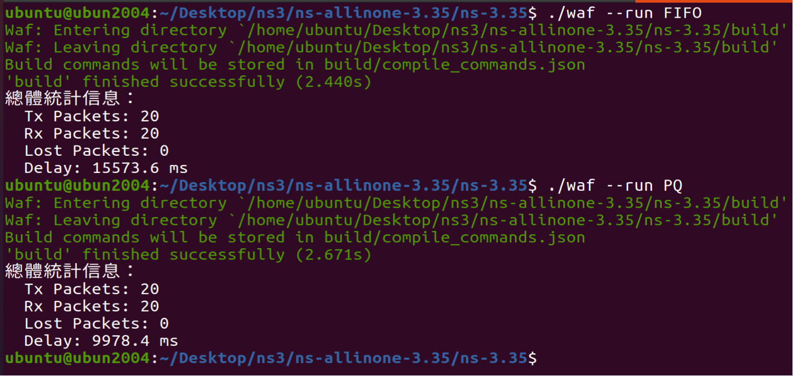

Lab2 - ns3 Scheduling
===
> Advisor : Hsi-Lu Chao
> TAs : 林書宇、李政峯
> 2023.10.26

---

# Code Result



# Fix Code
FIFO

```
原本的DataRate頻寬大小為500bps，是一個頻寬很慢的網路環境，
會導致封包掉包，所以只需要簡單的調高頻寬約十倍，效果十分顯著。
```

---

PQ

```
原本的DataRate頻寬大小為500bps，是一個頻寬很慢的網路環境，
會導致封包掉包，所以只需要簡單的調高頻寬約100倍，效果十分顯著。
```


```
如果說對這次的Lab有什麼想法的話，大概就是像這樣...
本次Lab模擬了過差的網路環境，讓封包傳送無法順利進行，
透過觀察封包大小，與修正頻寬完成Lab，也讓我對ns3模擬軟體更加了解!
```